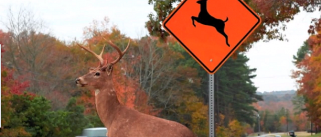

Deer Crossing Danger
========================

### Statistical Modeling: A Fresh Approach
#### Daniel Kaplan and George Leiter

```{r include=FALSE}
require(mosaic)
```

You've been recruited as a statistical consultant to a traffic safety community organization.  The organization has ramped up their activism in response to what they see as obstructionism by the local media. [This video](http://www.youtube.com/watch?v=CI8UPHMzZm8) is an example of the ridicule to which the group has been subjected.

After an original plea to move deer-crossing signs to safer areas, the organization is calling for the signs to be removed.  They believe that the signs are interpreted by deer as a safe place to cross, whereas the safety is really determined by the traffic and visibility conditions. 



The current goal of the organization is to remove 50% of deer crossing signs, those that occur in the areas with the highest number of accidents.  Proponents believe that removing the signs will lead to at least a 10 percent reduction in accidents.  Opponents of the sign removal have not been able to muster any evidence that the signs in fact are helpful (other than common sense). 

Your assignment is to design the preliminary study.  In particular, you have to advise the group on how many sign areas should be included in the study in order to be able to demonstrate if the sign-removal is helpful.  This is a question of determining the power of the study.

In researching the matter, you've found out that in areas with deer crossing signs, an average of 10 collisions per year occur.  You decide that the study should be run for a full year, in order to avoid seasonal variation.

```{r}
n = 10
simdata = data.frame(before=rpois(n, lambda=10))
```

Now you are going to identify the 50% of most dangerous intersections:
```{r}
threshold = qdata(.5,before,data=simdata)
simdata = transform(simdata,removeSign=before>=threshold )
``` 
Finally, you'll reduce the accident rate by 10% at the most dangerous intersections and generate a simulation of another year's data.
```{r}
simdata = transform(simdata,newrate=ifelse(removeSign,.9*10,10))
simdata = transform(simdata,after=rpois(n,lambda=newrate))
```

Just to confirm that these statements are doing the simulation properly, here is a box-and-whiskers plot showing the number of collisions (simulated) for those areas where the signs were removed ("TRUE") versus those where they weren't removed ("FALSE").
```{r fig.height=3,fig.width=3}
bwplot(after~factor(removeSign), data=simdata)
```

You can also model the reduction in accident rate as a function of whether the sign was removed:
```{r}
summary(lm(after-before ~ removeSign, data=simdata))
```

Interpret the coefficient on `removeSign` to make sure it goes in the direction you expect. 

The p-value of interest is in the second row, fourth column.  You can pull out that p-value like this
```{r}
coef(summary(lm(after-before ~ removeSign, data=simdata)))[2,4]
```


### Making an R function to generate data

Now you are going to build an R function to simulate the data.  The advantage of this is that you will be able to run the simulation many times easily.  The sample size, `n` will be an argument to the function.  

```{r}
simulateStudy = function(n=20,lambda=10,reduceTo=0.9) {
  res = data.frame(before=rpois(n, lambda=lambda))
  threshold = qdata(.5,before,data=res)
  res = transform(res,removeSign=before>=threshold)
  res = transform(res,newrate=ifelse(removeSign,reduceTo*lambda,lambda))
  res = transform(res,after=rpois(n,lambda=newrate))
  return(res)
}
```

### Doing the power calculation

You can pull out the p-value on one simulation like this:
```{r tidy=FALSE}
coef(summary(lm(after-before ~ removeSign,data=simulateStudy(n=10))))[2,4]
```

Modify that statement to repeat the simulation 100 times and tally how many times the p-value is less than 0.05.  This is the power.


```{r tidy=FALSE}
s = do(100)*coef(summary(lm(after-before ~ removeSign,data=simulateStudy(n=10,reduceTo=1))))[2,4]
```
### Coping with Criticism

Your friend laughs when they hear what project you are working on.  "Of course taking away the sign won't reduce the accident rate."  You argue, saying that this is just the sort of negative, elitist attitude that prevents citizen participation in governance.  You're friend sugest that you repeat your power calculation, but with the alternative hypothesis that there is no change in accident rate.  (That is, `reduceTo=1`.)  

Now it's your turn to laugh.  You say this is unnecessary.  `reduceTo=1` is the null hypothesis: no change.  You already know how often the null hypothesis will be rejected under the null hypothesis: it's 5%.  But do the simulation anyways to confirm your understanding.

Do you get the 5% you were expecting?  If your result surprises you, look up the term "[Regression to the Mean](http://en.wikipedia.org/wiki/Regression_toward_the_mean)."

How would you change the experiment and/or your analysis to deal with this situation, designing a study that gives a fair assessment of whether removing the deer-crossing signs reduces accidents?
