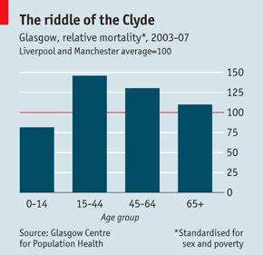

A Class for Parents
========================================================

### Danny Kaplan, Sept. 1, 2012

I was asked to lead a 45-minute statistics class for parents during Macalester's new-student orientation.

### A Motivating Story 

Macalester has a Scottish theme during orientation --- bagpipes, guides in kilts, etc. --- so I started with a recent article that fits the theme.

#### Unhealthy Glaswegians: No city for old men
From the *Economist*, Aug. 25, 2012, pp.44-5.  [link to article](http://www.economist.com/node/21560888).

"Even in wealthy neighbourhoods mortality rates are 15% higher than in similar districts of other big cities."

*QUESTION*: Since everybody dies eventually, the mortality rate world-wide is 100%.  How can it be 115% in Glasgow?

Answer: It's a mortality **rate**.  A rate is something per something else.  In this case, the rate is fraction of the population that dies divided by time: fraction per year.  For the US currently, this is about 8.39 per 1000 per year.  In the UK, it's about 9.33 per 1000 per year.  (I didn't have time to find the rate for Scotland, specifically.  Such data are easily available by country.)  So the UK rate is higher than the US rate by $latex 9.33/8.39 =$ `9.33/8.39`.  You would think that would be a bigger story: The UK as a whole has an 11% higher mortality rate than the US.

This is an example of what might be called "quantitative literacy."  Knowing what a rate is in general (a ratio), and what a mortality rate is in particular.  We spend some time on literacy, but as background.  We're not teaching literacy here; our goal is to teach advanced skills --- college stuff.  But of course one needs to build the advanced stuff on the basics, so we make sure to touch on the basics.

You kids, as you know, are going to school in an era where data are ubiquitous.  The challenge they will face is not acquiring data, but interpreting it.  For instance, a Google search will quickly lead you to a table (compiled by the US CIA!) of [country-by-country mortality rates](https://www.cia.gov/library/publications/the-world-factbook/rankorder/2066rank.html).  [Go look at it now!]

This is where I got the figures on US and UK mortality.  The table is ordered from highest morality countries (South Africa, Russia) to lowest mortality countries.  

It's instructive to look at countries with low mortality rates.  Singapore: 3.41/1000.
Kuwait: 2.13/1000. Qatar: 1.55/1000.  Qatar has the lowest.  Below that are places that are so small that, evidently, nobody died in 2012: the Pitcairn Islands (inhabited by descendents of the mutineers from the Bounty), Norfolk Island (British Australia's version of Devil's Island, long abandonned).

What conclusion do you draw from this quick look at the data.  That wealthy countries have a low death rate?  Or maybe you think about the Middle East.  Israel: 5.50/1000.  Egypt: 4.80/1000.  Egypt isn't so rich.  Iraq: 4.73.  West Bank: 3.56.  Gaza: 3.22.

Do you think the Israeli version of the *Economist* ever had a story: "No country for old men: Israeli morality 62% higher than in Palestinian territories?"

What's going on?  A paragraph at the top of the CIA page explains:

> This entry gives the average annual number of deaths during a year per 1,000 population at midyear; also known as crude death rate. The death rate, while only a rough indicator of the mortality situation in a country, accurately indicates the current mortality impact on population growth. This indicator is significantly affected by age distribution, and most countries will eventually show a rise in the overall death rate, in spite of continued decline in mortality at all ages, as declining fertility results in an aging population.

## Adjustment and Standarization: Covariates

From the *Economist* article:

> At first this seemed to be explained by poverty: poorer people are less healthy and Glasgow has lots of them.  But about ten eyars ago studies began to show that the city was still dying younger than it should have done.  Adjusting for age, poverty and gender, Glasgow has more than twice as many deaths from drink and drugs as Liverpool and Manchester.

Standardized for sex and poverty.  (Some age stratification is implicit.)

### SAT and School Expenditures

You likely have, in the back of your mind, thoughts about leaving your child at a new place, how lonely it will be back home ... or perhaps how pleasant it will be.  But maybe you're also thinking about how much money this all costs and whether it will be worth it.  Let's switch to an example that's related to this.

SAT versus per student expenditures for the different states.

George Will's statement on these data: a standard kind of interpretation.

## Computing

A primer on statistical inference.  It's based on randomization and random sampling.

## New work flows and publication

I came to college in 1977 with an electric typewriter from Sears and an envelope of chalk coated paper for making corrections by overtyping. In upper-level seminars, students were required to type their essays on mimeograph sheets so that they could be distributed to the others in the seminars. 

Your kids, like mine, may never have used a typewriter.  They communicate by email, by text.  They write for Facebook.

If you work in an office, chances are that you or someone you know uses Excel or a similar spreadsheet program extensively.  In many public schools, kids are taught to use Excel, Word, PowerPoint, and other such "productivity" software.  

My view, and I think the consensus view of my department, is that computing will continue to extend into the workplace and that it's important to prepare students for this future. But this doesn't mean teaching the technologies that are in mainstream use today, it means anticipating and preparing for the technologies of the workplace tomorrow.  Some of these:

* Collaborative authoring.
* Integration of technical computing and data-driven graphics
* What's coming to be called "reproducible research," that is, documents that are self documenting, verifiable, and can be updated easily.
* New publication modalities, including interactive graphics.

To that end:

* Every student who takes a statistics class in this department --- and half the students who attend Macalester will do so --- will learn a modern, technical computing system: R.  This is a professional level program originating in the old ATT Bell Labs that's growing very rapidly and is now in use or being adopted by major players such as Google and Oracle.
* They won't be doing menu-based calculations, they will use learn to express themselves in the computer language
* They will write and publish their work in a reproducible way.

As an example, even though I wrote them this morning, these notes these notes are already published on line at <http://dtkaplan.github.com/Statistical-Modeling-A-Fresh-Approach/Blog/OrientationForParents.html>.  

For the nerdy among you, this document is compiled from a Markdown/knitR source, which incorporates the computer examples into the document itself.  That's at <http://dtkaplan.github.com/Statistical-Modeling-A-Fresh-Approach/Blog/OrientationForParents.Rml>.  If your child is taking Introduction to Statistical Modeling, and you want to follow along, I'll happily make the book available to you online and provide you with an account on the Macalester RStudio server.  Write to <mailto:kaplan@macalester.edu>.