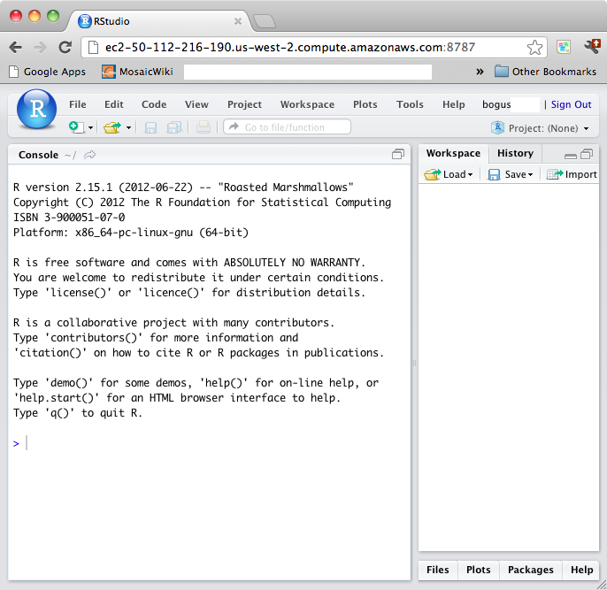

Starting with RStudio at Macalester
========================================================

### Your RStudio Account

If you are enrolled in a mathematics or statistics class at Macalester, an RStudio account has been set up for you.  *Exceptions*: Students who enroll during add/drop period.  Such students, and indeed any student who wants, can request an RStudio account [at this link](https://docs.google.com/a/macalester.edu/spreadsheet/viewform?formkey=dHJWYnlzdU10ZkFQRjRXcjhobWRORGc6MQ.)

### Logging in for the First Time

Go to <www.macalester.edu/rstudio> and login.  

* Your ID is the same as your Macalester email ID (e.g., "bsmith").
* Initially, your password is the last four digits of your student ID.  (If you request an account via the above form, your initial password will be the last four digits of the phone number you give us.)

Once you are logged in, your browser window will look like this:



It's OK that the URL has changed from www.macalester.edu/rstudio. The actual of the Macalester RStudio server is "in the cloud."  Funding for this service on the Amazon Web Services cloud is provided by the US National Science Foundation, Project MOSAIC, NSF DUE-0920350.

### Things to do after you log in
1. You may want to change your password, although you are welcome to keep using your initial password.  If you do change your password, make sure to keep track of it.  Unfortunately, we do not yet have the password system set up to make it easy for us to reset your password as needed. 
    * Select the Tools/Shell menu item on the menu next to the blue R ball. A dialog box will pop up.
    * At the prompt, type the command `passwd` and press return.
    * You will be asked for your initial password (the one you logged in with), and then prompted to enter your new password twice.  Standard thing that you see elsewhere, but without the nice interface.
    * If your password was too simple, the system will reject it.  
    * When you're done, close the dialog box by pressing the "close" button.
    
2. Bookmark the RStudio web page on your browser.  Of course, the URL, `www.macalester.edu/rstudio` isn't too hard to remember, either.

3. Students in Math 135, 153, and 155 should go to the tab marked "Packages" in the bottom right part of the window.  Scroll down to the `mosaic` package and check the box.  This will load the `mosaic` package into R.

Once you've done this, chances are you will never have to do these things again.

### Start to Play

For the most part, you will use R by typing commands into the "Console" window.  Just to get started, try these commands:
```{r results="hide"}
3+2
8*8
```
You're good to go.

### Resources

* **Math 135** "Applied Calculus" students: The *StartR in Calculus* book is [available online](ftp://www.mosaic-web.org/go/Repository/DannyKaplan/StartR-August-2012.pdf).
* **Math 155** "Introduction to Statistical Modeling" students: Instructions on R are provided in the last section of each chapter of the *Statistical Modeling* book.  The first chapter is [available online](http://www.mosaic-web.org/go/StatisticalModeling/Chapters/Chapter-01.pdf).