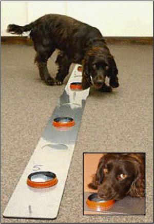
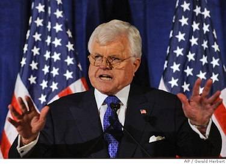
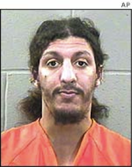
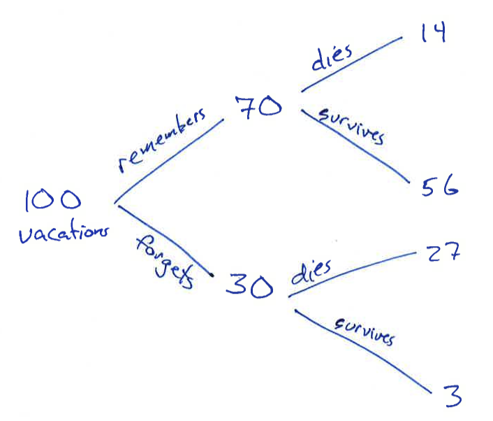
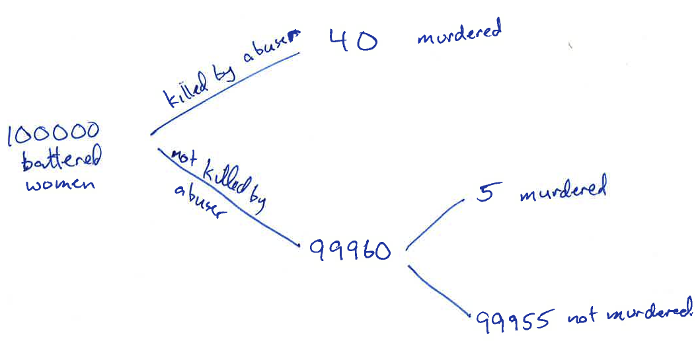
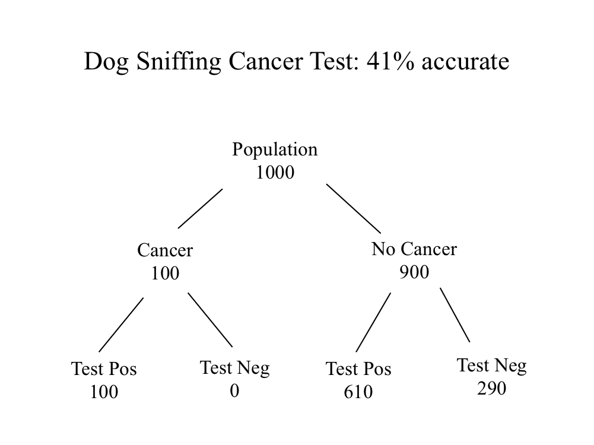
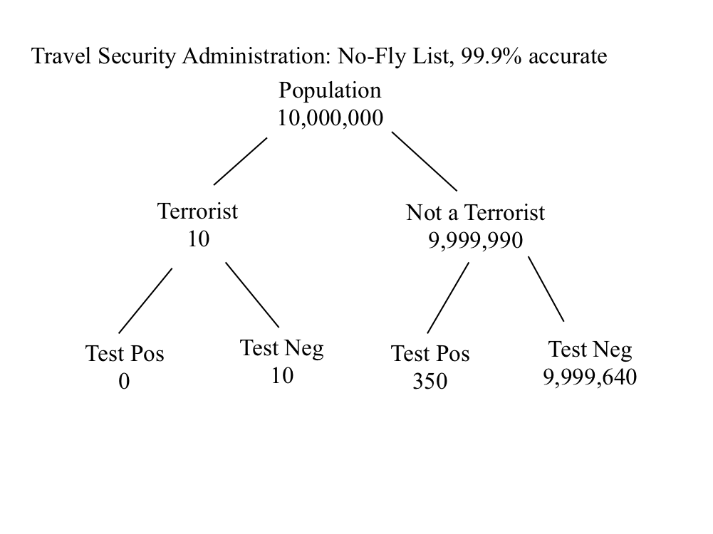
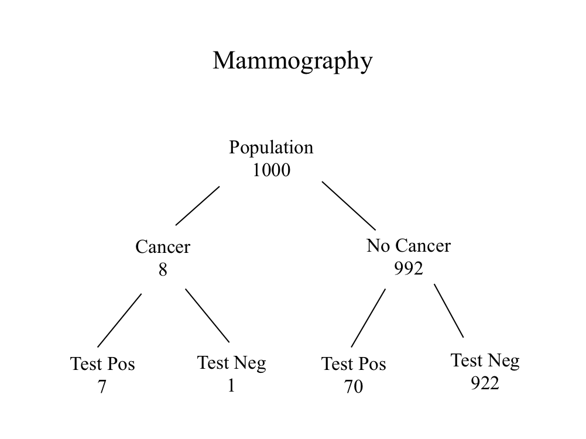

Epidemiology Notes 2012-11-20
=====================
```{r message=FALSE,error=FALSE,warning=FALSE,echo=FALSE,results="hide"}
require(mosaic, quietly=TRUE)
```

### In the News

* [Alzheimer's Detection](http://www.nytimes.com/2012/11/16/health/for-alzheimers-detection-advances-outpace-treatment-options.html) --- What are the benefits and what are the disadvantages?  Will it help?

* [Life expectancy and social security](http://www.nytimes.com/2012/11/16/opinion/life-death-and-deficits.html) --- Paul Krugman points out that an increase in life expectancy at birth is not the same thing as an increase in retirement duration.  We need to look at life expectancy at retirement age.

Screening and Detection
-----------

### What screening tests have you had?

* Tuberculosis
* women: PAP smear
* men: inquinal hernia (lifetime risk: 27% for men, 3% for women) --- "turn your head and cough"
* SAT/ACT tests for readiness to get into college
* First-year students: writing essay

### Essential Epidemiology on Screening

* First message is negative: [Box 15.1](http://dl.dropbox.com/u/5098197/Epidemiology/Figures/EE-Box-15-1.png) 
    * Why do people seem to like screening?  Possibility: it removes one of the fright factors (the condition comes under your control).  It also introduces "certainty" into the process.  You "know" whether or not you have the condition.
* What's needed for successful screening?
    * [Time line for intervention](http://dl.dropbox.com/u/5098197/Epidemiology/Figures/EE-Fig-15-1.png)
    * Condition should be severe, common, seen as a problem
    * Earlier detection should improve outcome
* Biases
    * Lead-time --- refer to Gigerenzer
    * Length-time bias.  Alzheimer survival estimated from sample of people in nursing homes on a given day--- tends to oversample the longer-duration cases.  How to avoid this?  Sample based on day of diagnosis.
    * Assumptions about positive effects of an intervention: "I would have died if they hadn't detected it."
        * Story about grad student in the MIT magnet lab in the 80s: detected a Berry aneurism. She died when being operated on. No way to know whether it was really a problem.

### Basic calculations and statistics 
Sensitivity, Specificity, PPV, NPV, Accuracy, Prevalence [Table 15.2](http://dl.dropbox.com/u/5098197/Epidemiology/Figures/EE-Table-15-2.png)

#### Tangle the Cancer Sniffing Dog

New York Times, September 28, 2004 
D.G. McNeil
**Moist Nose Shows Promise in Tracking Down Cancers**




*A dog named Tangle works his way along a line of urine samples during his search for one from a patient with bladder cancer. Tangle has been taught to lie down by a positive sample.*

British researchers have trained dogs to detect bladder cancer by sniffing human urine, opening up the possibility that dogs - or electronic noses modeled on their snouts - may one day be used to detect the disease.

The study, published in the British medical journal BMJ on Saturday, is the first to demonstrate scientifically that dogs can detect cancer through smell, its authors said.

The study, done at Amersham Hospital in Buckinghamshire, England, was small; **six dogs sniffed at 54 urine samples** after weeks of training.

As a group, they were only about **41 percent accurate**. That is far below what is considered acceptable on most medical tests, but the idea is in its infancy.

Dog tests might eventually be cheap and work early, and they also might be useful in poor countries, scientists said.

##### QUESTION:

Suppose another research group announced a test that was 95% accuracte?  Compare the new test to the dog test (which wwas 41% accurate).
1. The new test would be **much better**
2. The new test would be **somewhat better**
3. The new test might be **better or worse**
4. The new test would be **somewhat worse**
5. The new test would be **much worse**

#### Example: No-Fly List

**Terror no-fly list singled out Kennedy**
*Senator was stopped 5 times at airports*
Sara Kehaulani Goo, Washington *Post*, Aug. 20, 2004

Washington -- Sen. Edward "Ted" Kennedy said Thursday that he was stopped and questioned at airports on the East Coast five times in March because his name appeared on the government's secret "no-fly" list.

Federal air security officials said the initial error that led to scrutiny of the Massachusetts Democrat should not have happened even though they recognize that the no-fly list is imperfect. But privately they acknowledged being embarrassed that it took the senator and his staff more than three weeks to get his name removed. 

A senior administration official, who spoke on condition he not be identified, said Kennedy was stopped because the name "T. Kennedy" has been used as an alias by someone on the list of terrorist suspects. 

While he worked to clear himself, Kennedy kept having to wait in the terminal at Washington's Reagan National, Boston's Logan International and at least one other airport, his staff said. All the flights were on US Airways. 

When the senator checked in at the counter, airline employees told him they could not issue him a boarding pass because he appeared on the list. Kennedy was delayed until a supervisor could be summoned to identify him and give approval for him. 

Kennedy's description of his air travel troubles -- mentioned during a Senate Judiciary Committee hearing Thursday on the 9/11 panel's recommendations -- gave new life to questions about the quality and effectiveness of the no-fly list. Security, intelligence and law enforcement agencies established the list after the 2001 terrorist attacks. Critics said the senator's experience served as the latest example of how a system designed to improve security is instead targeting innocent travelers. 

The government does not make public the names or total number of people on the list, which officials say is constantly updated. According to FBI documents obtained by the American Civil Liberties Union under a Freedom of Information Act request, more than 350 Americans have been delayed or denied boarding since the list's inception. The list hasn't led to any arrests, officials said. 

The American Civil Liberties Union has filed a lawsuit on behalf of six Americans who have had experiences similar to Kennedy's. 

"That a clerical error could lend one of the most powerful people in Washington to the list -- it makes one wonder just how many others who are not terrorists are on the list," said Reggie Shuford, a senior ACLU counsel. "Someone of Sen. Kennedy's stature can simply call a friend to have his name removed, but a regular American citizen does not have that ability. He had to call three times himself." 

A Kennedy aide said the senator nearly missed a couple of flights because of the delays. After the first few incidents, his staff called the Transportation Security Administration, which maintains the no-fly list. But even after those discussions about getting his name removed, the senator was stopped again, according to Kennedy spokesman David Smith. 

Homeland Security Secretary Tom Ridge finally called to personally apologize about the mix-up, and the delays stopped in early April, Smith said. 

TSA spokesman Mark Hatfield said the no-fly system occasionally causes problems because the airlines are responsible for flagging passengers who show up on the list. 

"Administration of the list clearly needs to be changed and consolidated to be government-managed," Hatfield said. "This points out the weakness in having the names checked against passengers at hundreds of different airlines at thousands of different airline counters across the country."

##### QUESTION:

Imagine that the Travel Security Administration developed a retinal scanning screening system that is 99.9% accurate for detecting terrorists.

Do you think this is possible?
1. Yes
2. No
3. Depends on things about retinal scanning that I don't know.

If the test could be developed and deployed flawlessly, 
1. It would make things **safer** than the present system
2. It might make things **safer**
3. It would have **no effect**


### Two Kinds of Possible Errors

False Positive | False Negative
---------------|-----------------
Test positive but wrong | Test negative but wrong
 | 
Senator Kennedy | Shoe bomber Richard Reid

To understand the relationship between these two types of errors, you need a way to describe the rate of errors and the different ways of making an error.

The accepted language is called "conditional probability".
* Probability refers to things that happen with some frequency but not necessarily certainly.  
* Conditional probability refers to how probabilities can differ depending on the situation.

Two different types of notation:
* Algebraic,
    * Conditional: $latex p(A | B)$ reads "probability of A, given B." Also $latex p(B|A)$
    * Joint: $latex p( A \& B)$: probability of both A and B
    * Marginal: $latex p(A)$: probability of A regardless of B
* Diagram

Examples of different probabilities.  Hand out the headache/flu slips
* probability of headache
* probability of flu 
* probability of flu and headache
* probability of headache given flu
* probability of flu given headache


### Strogatz's Plant Watering Example

> Before going on vacation for a week, you ask your spacey friend to water your ailing plant.  
    * Without water, the plant has a 90 percent chance of dying.  
    * Even with proper watering, it has a 20 percent chance of dying.  
    * And the probability that your friend will forget to water it is 30 percent.  
    
Questions: 
1. What’s the chance that your plant will survive the week?  
2. If your friend forgot to water it, what’s the chance it’ll be dead when you return?
3. If it’s dead when you return, what’s the chance that your friend forgot to water it?  



### Headache and Flu

* If you have the flu, what's the chance that you have a headache?
* If you have a headache, what's the chance that you have the flu?

Which conditional probability would you be able to measure?
* Take a sample of people with headaches and test them for the flu?  Or,
* Find a sample of people with the flu and ask them if they have a headache?

The second is more practical, since people with the flu identify themselves.
It would be easy to find a sample of people without the flu (that's most everyone) and ask them if they have headaches.

### Murder of Battered Wives

[I.G. Good article in *Nature* v375, 15 June 1995](http://biostat.userweb.mwn.de/teaching/stobio2006/material/good.pdf)
* Statement of problem from the first paragraph
* That this appears in *Nature* demonstrates how mysterious the calculation is for most people.



### Cancer Sniffing Dog

Calculating the accuracy and the conditional probability



A worse test:

)

### TSA test (hypothetical)



### Mammography




### Tabular Presentation

Test result | True| State
------------| ----| ------
     .      | Sick | Well
------------|-----|------
     Pos      | A   | B
     Neg      | C   | D 
     


* Sensitivity: $A/(A+C)$.  For the Sick people, what is the probability of a correct (positive) test result.
* Specificity: $D/(B+D)$. For the Well people, what is the probability of a correct (negative) test restul.
* Prevalence: $(A+C)/n.  What fraction of the people are Sick


### Calculations from Epiville

[Epiville Screening Case Study](http://epiville.ccnmtl.columbia.edu/screening/data_analysis.html)

### Thermal-Imaging screening activity

