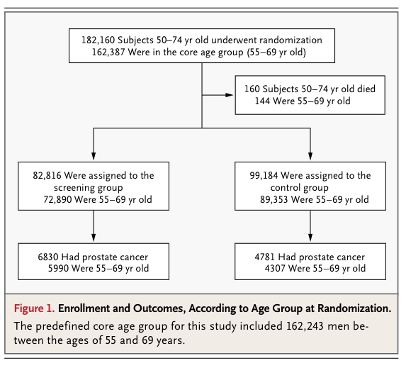
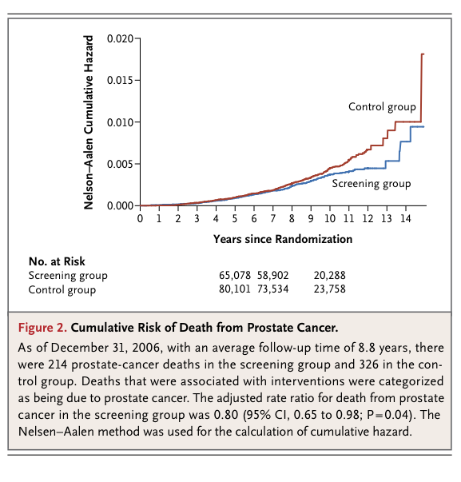
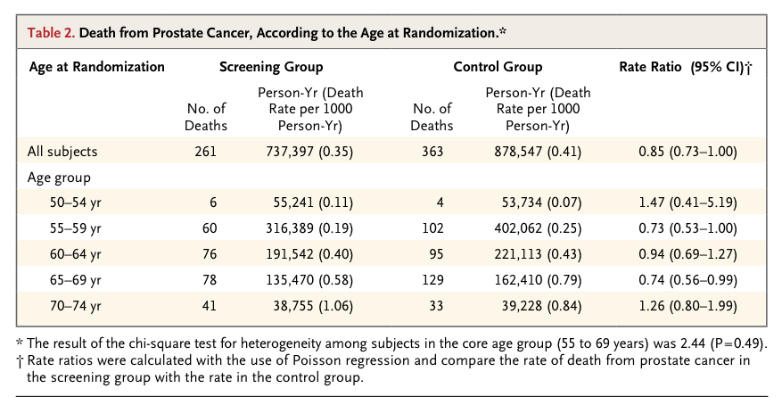
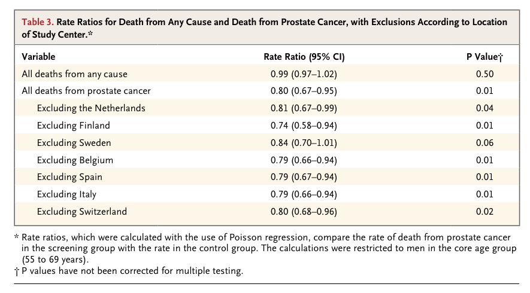

Epidemiology Notes 2012-11-29
=====================
```{r message=FALSE,error=FALSE,warning=FALSE,echo=FALSE,results="hide"}
require(mosaic, quietly=TRUE)
```

### [Quiz on Breast Cancer Risk](../Activities/cancer-risk-quiz.pdf)

[Breast Cancer risk estimation](http://www.cancer.gov/bcrisktool) Try various calculations and look at
* Age dependence (compare 35 year old to 65 year old)
* Age of first menstruation and of first child
* Effect of biopsy on risk.  Notice that it doesn't matter whether the biopsy was positive or negative.
* Note that mammography results don't enter in to the risk.


In The News
---------------

* [Whooping Cough and vaccine](http://www.huffingtonpost.com/2012/11/27/whooping-cough-immunity-vaccine-vaccination_n_2200172.html)
* [SARS again](http://www.npr.org/blogs/health/2012/11/26/165924257/sars-like-virus-resurfaces-and-infects-a-family-in-saudi-arabia?sc=ipad&f=1001)
* [Double Mastectomy to reduce breast-cancer risk](http://www.npr.org/blogs/health/2012/11/28/166064484/more-women-choose-double-mastectomy-but-study-says-many-dont-need-it?sc=ipad&f=1001)
* [Breast Cancer letter](http://www.nytimes.com/2012/11/28/opinion/the-value-of-mammograms.html)
* [... and the other way](http://well.blogs.nytimes.com/2012/11/28/ignoring-the-science-on-mammograms/?hp)


### Prostate Cancer

#### [European Study]

* Read the abstract: especially the results section. 
    * Relative and absolute risk of death
    * Absolute risk reduction, together with false-positive rate means that 48 men would be treated to prevent one death.
    * Need a better measure than "treated" vs "deaths".  How are we supposed to compare the two.


* [NEJM article](http://www.nejm.org/doi/pdf/10.1056/NEJMoa0810084)

* It's a large study



* Cumulative Hazard is somewhat different between treatment and control groups.



* Age breakdown.  Note the multiple comparisons.



* Effect seems to be coming from the Swedish study.  Note that the p-values are all telling the same thing, except for the one excluding Sweden.
* The all-cause mortality is the same in the two groups.  Just the prostate-cancer specific mortality is different.  If screening lowers mortality due to prostate cancer, how does it raise mortality from other causes?  Not clear how this could be, but the data seem to indicate it.


#### Preventive Services Task Force Recommendation

* [Statement for Consumers](http://www.uspreventiveservicestaskforce.org/prostatecancerscreening/prostatecancerfact.pdf)

* [Evidence Summary](http://www.uspreventiveservicestaskforce.org/prostatecancerscreening/prcascres.pdf)
    * Go through the "Structured Abstract"
    * Study selection
    * Go through three or four of the studies and discuss the ratings.
        * Note that several are criticized on the basis of low power.  When you fail to reject the null, there is a question of whether you failed because of no effect or because your study wasn't adequate.
    * Discussion
        * Contamination and non-compliance.
        * Prior PSA testing (maybe we're missing people with prostate cancer because they were previously screened out.)


### Receiver Operating Curve

President Garfield assassination

### Mad-Cow Disease


Trade-Offs
------------

### Know your Chances, Chapter 6 and 7

Weighing the costs and benefits 


Division into"life-threatening" and "symptom" side effects


Their tree on page 84


They are doing triage, separating out the easy cases and leaving it to the individual for the hard cases.

What's missing?  A strategy of "take the drug" and see if it's worthwhile for you.   

 

benefits versus costs with "individual person" as the case:
*Benefits positively correlated to cost --- more or less the same situation for everybody
*Benefits negatively correlated to cost --- will be worthwhile for some people but not for others.

*[information overload from warnings](http://www.sciencedaily.com/releases/2011/05/110523171058.htm)


Hard Trade-Off Problem
--------------------

### The Problem 

You are alone at an isolated beach with your two children, Anna and Bob, ages 5 and 1.  
* Anna goes swimming and is caught in an undertow.  
* You cannot swim well; you have a 50:50 chance of rescuing Anna or drowning yourself.

#### What should you do?

1. Save Anna (age 5) and leave Bob (age 1) on deserted beach risking drowning yourself (50% chance).
2. Stay with Bob and hope for the best with Anna.
3. Take Bob with you to try to rescue Anna.

#### Discussion

* There's no right answer.
* We think it's reasonable for people to make decisions based on their own beliefs.
* Still, the numbers make a difference.  
    * Slide the 50% chance toward zero and 100% and see how people's opinions change.
    * Is there another parent to take care of the surviving child?  Is there anyone else on the beach?
    * Is there any hope of rescue from someone else?

### Individual versus Social Decisions

In an decision made by an individual, you are entitled to use intuition.
 
Social decisions, if made by groups, must involve discussion and debate.

Mathematics provides a framework for discussing dilemmas and evaluating trade-offs.
It doesn’t provide the answer, just a way of making comparisons explicit.

#### A Social Dilemma

* [Implantable Cardioverters Defibrillators](http://www.nytimes.com/2002/03/20/us/tiny-heart-devices-reduce-death-rate-but-cost-is-concern.html)

##### Cost Analysis

For every 20 such patients given an ICD, on average one life will be saved.
* Cost: $30,000 x 20 = $600,000 per life

What else could we do with $600,000?  Drug treatment programs, head start, highway safety, pre-natal care.
* What is the added survival time?
* Personal versus societal decisions: 
> Dr. Zipes said he planned to implant defibrillators in patients who should be helped and argue with their insurers later.  "Very honestly, if it were I or my father or a loved one, I'd want them to get it," he said.

##### Question

How much should the government be willing to spend to provide implantable cardioverters-defibrillators?
* $50,000 per saved life
* $200,000 per saved life
* $400,000 per saved life
* $600,000 per saved life
* $800,000 per saved life
* $1,000,000 per saved life
* Don’t be crass, Kaplan.  You shouldn’t put a dollar value on life.

Would your answer to the previous question have changed if you took into account the age of the ICD recipient?
* No.  The value of a life doesn’t depend on age.
* No.  We told you not to be crass, Kaplan.  Now stop it.
* Yes.  It’s reasonable to spend less on an older person.
* Yes.  It’s reasonable to spend more on an older person.

### Terminology 

* **Policy variables** --- the inputs that we can set.  Examples: 
    * whether to give a drug/treatment, 
    * whether to have a screening program
    * whether to provide vaccinations
    * whether to require vaccinations
    * to have a co-pay for insurance
    * to have a waiting list for treatment
    * etc
* **Policy** --- a setting of all the relevant policy variables.
* **Outputs** --- the quantities that we are interested in obtaining. Example: number of lives, amount of disability, ....
* **Mechanisms** --- how the policy variables influence the outputs. Example: co-pays for insurance reduce people's use of medical services.

### Optimization

When there is a single output, we can adjust the policy variables to optimize the output. 

Optimization lets you make the best out of your resources.  But it requires a quantitative scale of output, which isn’t always possible.

#### Question

Choose the policy that gives the best value of the output.

<pre>
Worse        <----- C -------A -------D--B------>      Better
</pre>

#### Continuous Policy Variables

Example: Amount of insurance co-pay

Mechanisms: 
* Co-pays decrease use of medical services, which can reduce contact with sick people and allow more resources to be spent on people who really need it.
* But medical services also help some people.

The mechanisms conflict, producing an optimal value of the input to get the best output.

```{r include=FALSE}
require(mosaic)
```

```{r}
plotFun( 20 - x*exp(-x/30) ~ x, x.lim=c(0,100), lwd=3,xlab="Co-pay", ylab="Lost Days of Work",main="An Imagined Scenario")
```

### Optima with Two (or more) Objectives

<pre>
better on objective 2
 ^
 |    C
 |        
 |                               B
 |
 |
 |                           D
 |
 |
 |          A
 |
 |
--------------------------------------> better on objective 1

</pre>
