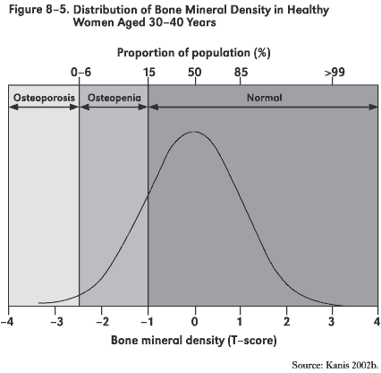

February 6, 2013 Class Notes
--------------------------
```{r include=FALSE}
require(mosaic, quietly=TRUE)
```

## Where you should be getting

* Can read in a data frame to R, find variable names, etc.
```{r message=FALSE}
apple = fetchData("M155/Stocks/aapl.csv")
names(apple)
```
* Can calculate simple summary statistics on a single variable: mean, sd, a quantile. etc.
```{r}
mean( Open, data=apple )
sd( Open, data=apple)
```
* Can produce a simple graphic of a distribution, e.g. bwplots, density plots.
* Can break down a calculation or display by the levels of a categorical variable, 
   * `mean(wage~sex, data=CPS85 )`
   * For graphics, there's a "group" argument and the "given" notation.
   * `tally` is weird.  There's nothing to the left of the `~`.  "and" or "plus" do the same thing, "given" does something different.
```{r}
cps = fetchData("CPS85")
tally(~sex, data=CPS85)
tally(~sector, data=CPS85)
tally(~sex&sector, data=CPS85)
tally(~sector&sex, data=CPS85)
tally(~sex|sector, data=CPS85)
tally(~sector|sex, data=CPS85)
```
* Understand why a 95% coverage interval is preferable to a range for many purposes.
* Understand how the standard deviation corresponds to a display and what are the units of the variance.  Understand that the terminology is old-fashioned:
    * "Standard" means "typical".
    * "Deviation" means "distance from a typical value"
    * Nobody uses this term, but the analogous term for a "mean" would be "standard value."
* Know that the variance is just the square of the standard deviation.  For technical reasons, we'll be using the variance and related measures a lot in this course.


## Distributions and Standard Deviation

### Example: Osteopenia.

Here's a quote from [Wikipedia](http://en.wikipedia.org/wiki/Bone_mineral_density): 
> Osteopenia is a condition where bone mineral density is lower than normal. It is considered by many doctors to be a precursor to osteoporosis. However, not every person diagnosed with osteopenia will develop osteoporosis. More specifically, osteopenia is defined as a bone mineral density T-score between -1.0 and -2.5.

The article goes on:
> The definition has been controversial. Steven R. Cummings, of the University of California, San Francisco, said in 2003 that "There is no basis, no biological, social, economic or treatment basis, no basis whatsoever" for using one standard deviation. Cummings added that "As a consequence, though, more than half of the population is told arbitrarily that they have a condition they need to worry about." [Quoted from this Gina Kolata article](http://www.nytimes.com/2003/09/28/us/bone-diagnosis-gives-new-data-but-no-answers.html)

 

Bone density falls with age.  The T-score is really just a Z-score, but compares a person to the distribution of young people.  [Some graphs](http://courses.washington.edu/bonephys/opbmd.html)

Osteopenia is defined so that about 1/6 of young people have it and much larger fractions of old people will have it. 

### Example: One-Day Changes in Stock Prices

The stock market goes up and down every day.  By how much?  
```{r}
apple = fetchData("M155/Stocks/aapl.csv")
netflix = fetchData("M155/Stocks/nflx.csv")
facebook = fetchData("M155/Stocks/fb.csv")
```

* What are the names of the variables? What is a case?
* Create a new variable, `change` that is the ratio of the closing price to the opening price.
```{r}
apple = transform(apple, change=Close/Open)
netflix = transform(netflix, change=Close/Open)
facebook = transform(facebook, change=Close/Open)
```

What's the distribution?  What's a typical value?  Do the stocks have different typical values?  What does the standard deviation tell you here?


#### Aside:

If you want to plot out the values versus time, you need to turn the Date variable into a format that can be used by R.  Here's how:
```{r}
fetchData("getDJIAdata.R")
apple = fixStockDate(apple)
netflix = fixStockDate(netflix)
facebook = fixStockDate(facebook)
```

### Activity: Sketch Some Distributions

* Household Income in the US
* Household Net Worth in the US
* College tuition ([resource](http://centerforcollegeaffordability.org/archives/6728))
* Number of courses completed by Macalester students.
* Age of Macalester students.
* House prices
* Body weight of adults
* SAT scores
* Human gestational length
* Infant birth weight


You might want to start with an estimate of the mean or median and the 95% coverage interval.  
Also, think about the tails of the distribution.  
* Are they likely to stretch out one way or the other in an asymmetric way, that is whether the distribution is likely to be skew one way or the other.
* Are they likely to be truncated.
* From your sketch, estimate the standard deviation and the IQR.  Is one easier to estimate than the other.


Spend 3 minutes using the web to see if you can get any confirmation from the Internet for your estimates.

* 
* [Distribution of income](http://en.wikipedia.org/wiki/Wealth_in_the_United_States#Distribution_of_wealth) --- Why is the mean so much larger than the median?  What would the box-and-whiskers plot look like?

### Measurement and measurement bias
* Instrumental or procedural error. Measure heights of people with a ruler, but with the ruler not level.
* Subject or response bias: "How many of you are intravenous drug users?"
* Global warming. Measurement gauges have been encroached on by urbanization.


### Sampling and sampling bias
* Self-selection bias for surveys
* Problems with convenience samples: e.g., interview students at library on Friday night about their study habits
* Selection and survival bias: we don't see the kids who drop out of school, tracking a random sample of Alzheimer's patients to see how long they survive --- you're more likely to sample those who survive a long time.

### Random sampling
* Sampling frame and formal methods.  Use `sample` 

#### In-Class Activity

* Sampling Bias Activity `s = select.books()` which needs to be proceeded by
```{r}
fetchData("simulate.r")
```

[Instructor's write up](../Activities/SelectingLibraryBooks.html)


### Descriptions of Distributions

Main points
* Use the density itself if you are interested in the distribution.
* The smallest meaningful description of a distribution includes at least two attributes, which can be conveyed in two different but closely related ways:
    * (1) center and (2) width
    * (1) lower end of range to (2) upper end of range
* There is a conceptual trade-off between comprehensiveness and relevance.  
    * To have a comprehensive description, you would include the full range, for 100% of the distribution.  
    * But this would include even the outliers, members of the distribution that are not at all representive of the bulk of the distribution.
* To resolve the trade-off, it's typical to consider the central mass of the distribution.  Two common ways:
    1. The 50% coverage interval
    2. The 95% coverage interval.
* For a rough and ready measure of the center and width of a distribution, we'll use the **mean** and **standard deviation**.  These are not without difficulty (e.g., they are not robust to outliers) but they have very nice mathematical properties that simplify interpretation in complicated systems.  It turns out that we can avoid the difficulties without sacrificing much in simplicity of interpretation by some simple strategies, e.g. the rank transform.  We'll talk more about this when we have mastered interpretation in settings without problems relating to outliers.


