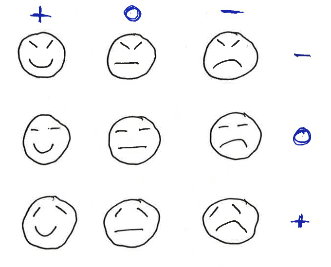

February 8, 2013 Class Notes
========================================================

```{r include=FALSE}
require(mosaic)
```

## Basics about models

1. A model is a representation for a purpose.  What the best model is depends on your purpose for constructing the model.  This requires judgment.
2. Statistical models (a) attempt for account for case-to-case variation in a variable (b) are based on data and (c) put the variation that's accounted for in the context of the variation that remains unexplained.
3. The usual form of a statistical model is response $= f$(explanatory).  That is, we imagine that for each value of the explanatory variables there is a unique model output.  Reality generally doesn't work this way. 

## A mathematical model of human mood with two parameters.  

These pictures are representations of mood.  They capture some aspects of mood but not every nuance.



* Which one of these is the best representation of your mood today?
* Which word would you use to label each graph?

I call my model a mathematical model since it is governed by two mathematical quantities: the curvature of the mouth and the slope of the (left) eyebrow.

The word is also a model.  That we can communicate without the word is evidence that the cartoon face really is representing something.

More skilled modelers can add more details --- more parameters, more levels to the parameters --- to get a better representation.


Important components of statistical models:
* The **response variable**.  The quantity that varies from case to case whose spread is something we want to account for.  

Example: **wage** varies from person to person.

* **Explanatory variables**.  Other variables that we think may account for the response.  For the present, we'll work with categorical variables.  Each case falls into one group, and our model is that the groups are different from one another but the individuals within the group are all the same.  

Example: wage might depend on sector of the economy or sex or something else.

```{r}
cps = fetchData("CPS85")
```
We can quantify the amount of variation using the standard deviation:
```{r}
sd( wage, data=cps )
```

* The **model values**.  For each group, there will be one model value.  That is, according to our model, each case has a response value that is the value for that case's group.

Example: We might model wage by sex as "Men make $3 per hour, women make $5 per hour"

You'll never have to do this, but here's one way to implement that model:
```{r}
fetchData("m155development.R") # some new software
mymod = listFun(M=3,F=5)
```
This is a function that takes "M" or "F" as an input and returns the model value.

Let's add these as variable `modvals` to the data
```{r}
cps = transform(cps, modvals = mymod(sex))
```

* The **residuals**.  These tell how far the model values are from the actual values;
```{r}
resids = with(data=cps, wage - modvals)
```

One way to quantify the "goodness" of a model is with how far off the residuals are from their ideal value: zero.  The mean square residual is a good measure of this:
```{r}
mean( resids^2  )
```

As with the arrows, there are two components to this: bias and variance.
```{r}
mean(resids)  # bias, the systematic error
var(resids)   # the random error
sd(resids)    # the square root of the variance
```

The above model has a big bias.  We want to choose the model values to make the sum of squared errors as small as possible.  Ideally, we can make the bias zero.  This is actually easy.  We do it by **fitting** the model, adjusting the parameters to match the data as closely as possible.  The `mm()` function will fit model values to the data.  

* The **fitted model values**.  Let's use as model  values the means of the groups.
```{r}
mean( wage ~ sex, data=cps)
f2 = listFun( M=9.995, F=7.879)
cps = transform(cps, means = f2(sex))
resids = with(cps, wage-means)
mean( resids^2 ) # This model is better than the earlier one!
mean( resids ) # No bias!
sd(resids)
```

The `mm()` function does these calculations for us in a convenient way, allowing us to extract the residuals and fitted model values without all the work.
```{r}
mod = mm( wage ~ sex, data=cps )
mean( resid(mod)^2 )
mean( resid(mod)) # No bias!
sd( resid(mod)) 

```
Any difference between the "by hand" version and the mm version is due to rounding off when typing in the mean values.
sd(resid)


## Constructing some models

[A handout for students](https://dl.dropbox.com/u/5098197/ISM/Unfit-Models.pdf)

We're going to build some groupwise models.  Later on, we're going to **fit** models, that is, let the data dictate the model parameters in some *optimal* way.

We'll be using some new software, so make sure to load it:
```{r message=FALSE,results="hide"}
fetchData("m155development.R")
```

Construct each of these models but make up **your own parameters**, don't just use the ones here.  (Of course, you won't have a solid idea of what the parameters should be.  Just use your best judgment.) Test out your function by giving it, in quotes, 
the level as an input.


* A model of height versus sex.  Levels for sex: M and F.
```{r}
height = listFun(F=63,M=68)
height("F")  # testing it for females
```

* Age at marriage as s function of race.  Levels of Race: Black, Hispanic, White
```{r}
age = listFun(Black=25,White=28,Hispanic=22)
age("Hispanic")
```

* Monthly cost of buying $10-50K of life insurance from the AARP versus sex.  Level for sex: F and M
```{r}
cost = listFun(F=20,M=24)
cost("M")
```

* Probability of dying in the next 30 years versus smoking status.  Levels for smoker: Yes and No
```{r}
dead = listFun(Yes=.8,No=.4)
dead("Yes")
```

INSTRUCTIONS TO STUDENTS: Make your own model for each of these.  Then we're going to have a competition.

## Evaluating your model against data

We happen to have some data that reflects each of these situations.  The data sets are:
```{r}
g = fetchData("Galton")
m = fetchData("marriage.csv")
i = fetchData("AARP-insurance.csv")
w = fetchData("whickham.csv")
```

### Look at the data sets

* See what the variables are and what they are named.  In particular, note the names of the relevant response variable and explanatory variable for each of the 4 cases.
* Make sure you understand what the variables stand for and their levels.
* Pick out one or more other variables that might play a valuable role in accounting for variation in the response variable.

### Find the model values for these data

Add another variable to each data frame that gives the model value.  Call it `modval` so that we can remember it.

Your statements will look like this:
```{r}
g = transform(g, modval=height(sex))
m = transform(m, modval=age(Race))
i = transform(i, modval=cost(Sex))
w = transform(w, modval=dead(smoker))
```

Do a scatter plot of the model value against the response value.
```{r out.width="2in"}
xyplot( modval ~ height, data=m )
```
Explain the pattern you see.

What's special about the `w` data and it's model values:
```{r out.width="2in"}
xyplot( modval ~ smoker, data=w )
```

### Evaluate your models 

Take the difference between the response value and the model value, and assign that to a variable called resid
```{r}
g = transform(g, resid=height-modval)
m = transform(m, resid=Age-modval)
i = transform(i, resid=Cost-modval)
w = transform(w, resid=outcome-modval)
```
What's special about `w`?

For each of the first three settings, evaluate your residuals for bias and variance.  Let's find who has the best model.

For my `g` model:
```{r}
mean( resid , data=g )
var( resid, data=g )
```

Write down the bias and variance for each person's model in sorted order (order by variance).

### Fitting models

The models for each setting differ from person to person in the class depending on the **parameters** that we choose.  

We can pick the "best" model for the class by picking the one with the smallest bias and variance. 

**Fitting** is the process of doing this automatically.

The `mm()` function will fit models in one step.  You specify the response and explanatory variables and the data you want to use in fitting the model.

```{r}
mod1 = mm( height ~ sex, data=g )
mod2 = mm( Age ~ Race, data=m )
mod3 = mm( Cost ~ Age, data=i )
```

We can't fit the smoking data this way because the outcomes aren't quantitative.  So the subtraction that we use in defining the residuals doesn't apply.

How does the bias and variance of the residuals in the fitted models compare to the models that you just made up.

CONCLUSION: It makes sense to fit models rather than just make them up when you have a choice.

## Effect Size

Comparing the fitted parameters gives us a way to quantify the **effect size**.

Another way to quantify the effect size is to look at the variance of the **fitted model values**.

See if you can find a relationship between the variance of the fitted model values, the variance of the residuals, and the variance of the response variable.

## Crossing Groups

Use `mm()` to fit wage against both sex and sector in the CPS85 data.  Explain the structure of the results.

## Going further

We'll be able to fit models beyond the groupwise models, including quantitative explanatory variables.  For instance:
```{r}
lm( Cost ~ Sex + Age + Coverage, data=i)
```

## Adding more variables.

Show that the variance of residuals goes down as you add more terms.


