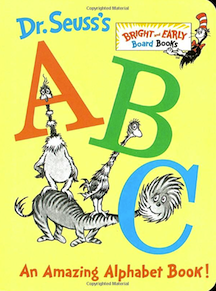
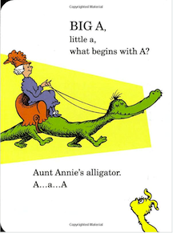

March 1, 2013 Class Notes
=============

```{r include=FALSE}
require(mosaic)
options(na.rm=TRUE)
```

### Tomorrow (March 2) is [Dr. Seuss](http://en.wikipedia.org/wiki/Dr._Seuss)'s birthday!

He's best known for his children's books, but he also did propaganda work during World War II.  [Private Goldbrick SNAFU video](http://www.youtube.com/watch?v=9J2i7cE6r4c)

 ...  ... 

--------------

Connecting this to Statistics:


## Things to remember about variables (as vectors):

1. Each of the terms in a model gets translated into one or more vectors.
2. A set of vectors, in mathematics, is called a **matrix**.
3. You can see the matrix for a particular model by applying the `model.matrix` operator to the model.
4. *For the mathematically inclined ...* 
    * Fitting a model amounts to solving $A x = b$ for $b$ being the response vector and $A$ the model matrix.  $x$ are the coefficients.
    * The model matrices are not square.  They are therefore solved by $A=QR$ decomposition.  Q is the matrix that defines the model subspace.  As with all orthonormal matrices, Q^T * Q = I. Multiplying $A x = Q R x = b$ by Q gives $R x = Q^T b$.  
    * Q^T amounts to projecting b down onto the subspace defined by Q.
    * Drop all but the non-redundant columns of $R$ to produce an invertible, square matrix.  Multiplication by $R^{-1}$ corresponds to finding the coefficients on each of the vectors in Q.
1. Each quantitative variable gives a single vector (as a "main effect").  Transformation terms are also single vectors (e.g. squares, logs, square roots).
2. Each categorical variable gives a set of mutually perpendicular vectors: one for each level of the categorical variable.  A set of vectors describes a subspace.  Show the R notation.
3. The intercept is a vector of all ones.  It lives in the supspace of each and every categorical variable.  Show the R notation.
4. We always project down the response variable onto the subspace defined by all the model vectors.  The residual is orthogonal to each and every one of the model vectors.

A demo:
```{r}
cps = fetchData("CPS85")
small = droplevels(sample(cps, size=8)) # Get rid of unused levels
small$orig.ids <- NULL
small
mod = lm( wage ~  educ + age*sector, data=small)
model.matrix(mod)
```

Compare the columns of the model matrix to the original data.  Note the name of each vector.

### Let's demonstrate that

1. Fit a model of your choice.  
2. Find the residual.
3. Construct some model vectors:
    * Quantitative variable ("main effect"): just the variable itself
    * Indicator vector for a particular level of a categorical variable, use `==` as in `sex=='M'`
    * Interaction vectors: multiply the two vectors involved.

## Today's concepts

1. Alignment among **explanatory** vectors means that the coefficient reflects each vector in the context of the other vectors.
1. Redundancy is when there are more vectors than needed to define a subspace.
2. Redundancy is a problem, since it adds ambiguity: there is an infinite number of ways to get to any point.

## Measuring Alignment

* The angle is the natural way to measure alignment.
* We are generally not interested in the intercept per se.  So we consider each of the other vectors in the subspace that is perpendicular to the intercept, called the **orthogonal complement** to the intercept.
    * "The variance is proportional to the squre length." This is true only in the orthogonal complement.   Hold up two vectors, one of which is marked as the intercept.  Arrange these so that the intercept points directly at the projector and is therefore a point on the screen.  The screen is the orthogonal complement to the intercept.  The square length of the other vector **on the screen** is proportional to the variance of the components.  Note that the variance is the **mean** square length, dividing by the dimension of the space.  But the space is that of the screen, which has dimension $n-1$.
    * "One indicator is always redundant with the intercept."  Hold up three vectors: two perpendicular indicator vectors and the intercept in between them.  Point the intercept at the projector.  The two indicator vectors will point in opposite directions --- they are redundant.
* When considering the alignment of two vectors, it makes sense to consider angles between 0 and 180 degrees, but not angles greater than 180 (because they must correspond to the same arrangement as an angle less than 180).  Little r measures this alignment between two vectors.  It is the cosine of the angle between the vectors (in the orthogonal complement to the intercept).
* Big R^2 tells about the alignment between a given vector and multiple other vectors.  It makes sense to consider only angles between 0 and 90 degrees as unambiguous, since that is the smallest angle you can find between the space and the vector.

Big R, little r, are different.  R = $\sqrt{R^2}$ and is always positive.  $r$ is the cosine of the angle between two vectors and might be positive or negative, depending on whether the angle is less than or greater than 90 degrees.

### Demonstration of little r in case and variable space.

Read in the manipulate software.
```{r}
fetchData("M155/littleR.R")
```
Run `littleR`.

The blue vector is constructed from a linear combination of a red vector and a black vector.  Move the slider to change the amount of the black vector that goes into the sum.  

The vectors are being displayed in both variable space and case space.  Notice how the roundness of the case-space cloud reflects the angle.  The correlation coefficient, r, corresponds to the roundness and to the angle $\theta$ between the blue and black vectors.

## From little r to BIG R

Exercise showing vector relationships among

1. SAT, frac, expend
2. Diabetes, weight, age

Why adding a new explanatory variable, even when it's not strongly correlated with the response, makes BIG R bigger --- the alignment is closer with the plane.

Xeroxed sheets with angle cut-outs.


### Redundancy Exercise 

(perhaps as a take-home)

