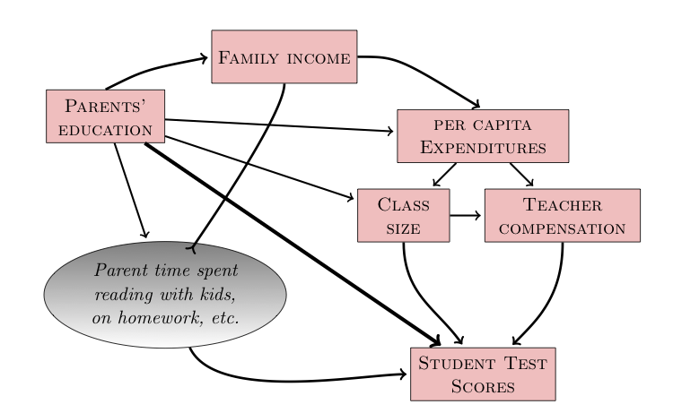

Monday April 29, 2013 Stats 155 Class Notes 
================================

```{r name="setup", child="notes-setup.Rmd"}
# boilerplate
```
$latex \newcommand{\ensuremath}[1]{#1}
\newcommand{\pathway}[1]{\hbox{#1}}
\newcommand{\causes}{\ensuremath{\Rightarrow}}
\newcommand{\causedBy}{\ensuremath{\Leftarrow}}
\newcommand{\correlatedWith}{\ensuremath{\nLeftrightarrow}}$


```{r tikz-ex, echo=FALSE,eval=FALSE,engine = "tikz", fig.cap = "Funky tikz", fig.ext = 'png', cache=TRUE}
\usetikzlibrary{arrows}
\begin{tikzpicture}[node distance=5cm, auto,>=latex', thick, scale = 2.0]
\node (P) {$P$};
\node (B) [right of=P] {$B$};
\node (A) [below of=P] {$A$};
\node (C) [below of=B] {$C$};
\node (P1) [node distance=1.4cm, left of=P, above of=P] {$\hat{P}$};
\draw[->] (P) to node {$f$} (B);
\draw[->] (P) to node [swap] {$g$} (A);
\draw[->] (A) to node [swap] {$f$} (C);
\draw[->] (B) to node {$g$} (C);
\draw[->, bend right] (P1) to node [swap] {$\hat{g}$} (A);
\draw[->, bend left] (P1) to node {$\hat{f}$} (B);
\draw[->, dashed] (P1) to node {$k$} (P);
\end{tikzpicture}
```

#### Confounders as a diagram

```{r confounder, engine = "tikz", fig.cap = "Funky tikz", fig.ext = 'png', cache=TRUE, echo=FALSE}
\usetikzlibrary{arrows,shapes,snakes}
\begin{tikzpicture}[node distance=5cm, auto,>=latex', thick, scale = 2.0]
\node[rectangle,fill=blue!10] (V) {\LARGE Variable};
\node[rectangle,fill=blue!10] (Out) at ([shift={(3,0)}] V) {\LARGE Outcome};
\node[ellipse,fill=red!10] (A) at ([shift={(1.5,-1.5)}] V) {\LARGE Confounder};
\draw[->,ultra thick] (V) to (Out);
\draw[<->,ultra thick,bend right] (V) to (A);
\draw[<->,ultra thick,bend right] (A) to (Out);
\end{tikzpicture}
```

#### SAT versus per-student spending

Draw the causal diagram

```{r sat, engine = "tikz", fig.cap = "Funky tikz", fig.ext = 'png', cache=TRUE, echo=FALSE}
\usetikzlibrary{arrows,shapes,snakes}
\begin{tikzpicture}[node distance=5cm, auto,>=latex', thick, scale = 2.0]
\node[rectangle,fill=blue!10] (Spend) {\LARGE Spending};
\node[rectangle,fill=blue!10] (SAT) at ([shift={(3,0)}] Spend) {\LARGE SAT};
\node[ellipse,fill=red!10] (Focus) at ([shift={(-.5,-2)}] Spend) {\LARGE \parbox{3cm}{\raggedright Focus on Education}};
\node[rectangle,fill=blue!10] (Frac) at ([shift={(.5,-2)}] SAT) {\LARGE \parbox{3cm}{\raggedleft Fraction taking SAT}};
\draw[->,ultra thick] (Spend) to (SAT);
\draw[->,ultra thick] (Focus) to (Frac);
\draw[<->,ultra thick,bend left] (Focus) to (Spend);
\draw[->,ultra thick] (Frac) to (SAT);
\end{tikzpicture}
```


<pre>
Spending  ---------->      SAT    <-------|
      |                                   |
Focus on Educ. ---> fraction taking SAT  -|
</pre>

#### Campaign Spending and the back-door network

Research in political science shows that higher spending in campaigns is related to a lower vote for the incumbent.  Yet it's common sense that higher spending improves things for the candidate; that's why they do it.

<pre>
  Polls <-----    Popularity ---> vote outcome
    |                                 ^
    v                                 |
  Spending ---------------------------
</pre>

### How to block a back-door?

We've done it by including the covariate in the model.  But this is too crude an answer.

### Example: Election Spending

```{r}
fetchData("simulate.r")
campaign.spending
equations(campaign.spending)
```
You can see from the equations how spending is related to vote: it increases it.  Let's look at what a statistical model has to say
```{r}
d = run.sim(campaign.spending, 435 ) # number of congressment
summary( lm( vote ~ spending, data=d))
```
The problem: a back door pathway from spending to vote via popularity.  Block it by including a node on the pathway as a covariate.

```{r}
summary( lm( vote ~ spending + polls, data=d))
```


### Software for Simulation

You should do this even if you already have done so.  There were some corrections made to the software.

```{r}
fetchData("simulate.r")
```

### An example hypothetical causal network

If we want to study the direct link between class size and test scores, we need to block the backdoor pathways.



### Chains in Causation

Following the convention used throughout the book
* $A$ is a response variable
* $B$ is an explanatory variable
* $C$ is a covariate.  We'll also use $D$, $E$, etc. as covariates and $U$ or $?$ as unobserved variables.

#### Three linear pathways:
* **Causal mediator**: $latex A \causedBy C \causedBy  B$.  Simulation: `cnet.mediator`
* **Common cause**: $latex A \causedBy C \causes B$. Simulation: `cnet.common.cause`
* **Witness**: $C$ is caused by both $A$ and $B$: $latex A \causes C \causedBy B$. Simulation: `cnet.witness`

#### A circular pathway
* A **recurrent network** (or, closed loop of causation): : $latex A \causes B \causes C \causes A$ or the variations.

We won't deal with these.  They raise questions about "when".

#### Correlation

The notation $latex A \correlatedWith B$ means that there is a non-causal connection between $latex A$ and $latex B$.  This must be because there is some unobserved variable $U$ producing the correlation, such as 

1. $latex A \causedBy U \causes B$
2. $latex A \causes U \causedBy B$

Note that if either of the arrows went the other way, we'd simply have $U$ being a causal mediator.

We'll see later that (1) is not a possibility if $U$ is unobserved and unconnected to anything else.

### The Rules for Observing or Blocking a Pathway

Remember, we want to study the **causal** relationship between $latex A$ and $latex B$ and are trying to decide whether to include the covariate $latex C$.

* Causal mediator: Including $latex C$ **blocks** the pathway, which is otherwise open.
* Common cause: Including $latex C$ **blocks** the pathway, which is otherwise open.
* Witness: Including $latex C$ **opens** the pathway, which is otherwise blocked.

### Confirming these rules

Run a simulation of $latex A$ against $latex B$.  When the coefficient in a model is zero, the pathway between $latex B$ and $latex A$ has been blocked. 

#### Mediator

```{r}
equations(cnet.mediator)
s = run.sim(cnet.mediator, 1000 )
coef( summary( lm( A ~ B, data=s )))
```
The above model indicates that the pathway is open.

Including the covariate $latex C$ blocks the pathway between $latex B$ and $latex A$.
```{r}
coef( summary( lm( A ~ B + C, data=s )))
```

### Common Cause

```{r}
equations(cnet.common.cause)
s = run.sim(cnet.common.cause, 1000 )
coef( summary( lm( A ~ B, data=s )))
```
The above model indicates that the pathway is open.

Including the covariate $latex C$ blocks the pathway between $latex B$ and $latex A$.
```{r}
coef( summary( lm( A ~ B + C, data=s )))
```

### Witness

```{r}
equations(cnet.witness)
s = run.sim(cnet.witness, 1000 )
coef( summary( lm( A ~ B, data=s )))
```
The above model indicates that the pathway is blocked.

Including the covariate $latex C$ opens the pathway between $latex B$ and $latex A$.
```{r}
coef( summary( lm( A ~ B + C, data=s )))
```

### The Jock Network 

Imagine that we wanted to study the relationship between athletic ability and SAT scores.  The conventional wisdom is that athletes tend to have lower test scores.  The `jock` network implements one hypothesis.

```{r}
s = run.sim(jock, 1000)
head(s)
```

In practice, SAT and athletic ability data on an individual might be available via a college, so let's pull out just the cases that are in college:
```{r}
college <- subset(s, College=="Yes")
```

Look at the relationship between IQ and Athletic:
```{r}
coef(summary(lm( IQ ~ Athletic, data=college)))
```

There is a relationship!

Now look at the entire set of data:
```{r}
coef(summary(lm(IQ~Athletic, data=s)))
```
The relationship has disappeared.  Why?

ACTIVITY: Look at the structure and equations of the `jock` network and explain.

### In-Class Activity

Here is the complete set of simple causal pathways among three variables.

* In each case, write down whether the pathway is a mediator, a common cause, or a witness.
* We've only studied the pathways with C in the middle.  For the others, figure out whether including C as a covariate opens or blocks the pathway between A and B.
* Come up with a setting which assigns a meaning to A, B, and C.  Example: B is taking nitroglycerin, C is dilation of the arteries, A is getting a headache.  

The possibilities for who can be in the middle: $latex A$ or $latex B$ or $latex C$

#### $C$ in the middle

* $latex B \causedBy C \causes A$
* $latex B \causedBy C \causedBy A$
* $latex B \causes C \causedBy A$
* $latex B \causes C \causes A$

#### $A$ in the middle

* $latex B \causedBy A \causes C$
* $latex B \causedBy A \causedBy C$
* $latex B \causes A \causedBy C$
* $latex B \causes A \causes C$

#### $B$ in the middle

* $latex A \causedBy B \causes C$
* $latex A \causedBy B \causedBy C$
* $latex A \causes B \causedBy C$
* $latex A \causes B \causes C$


